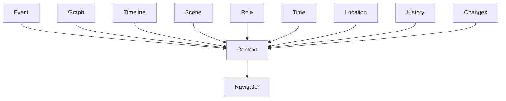
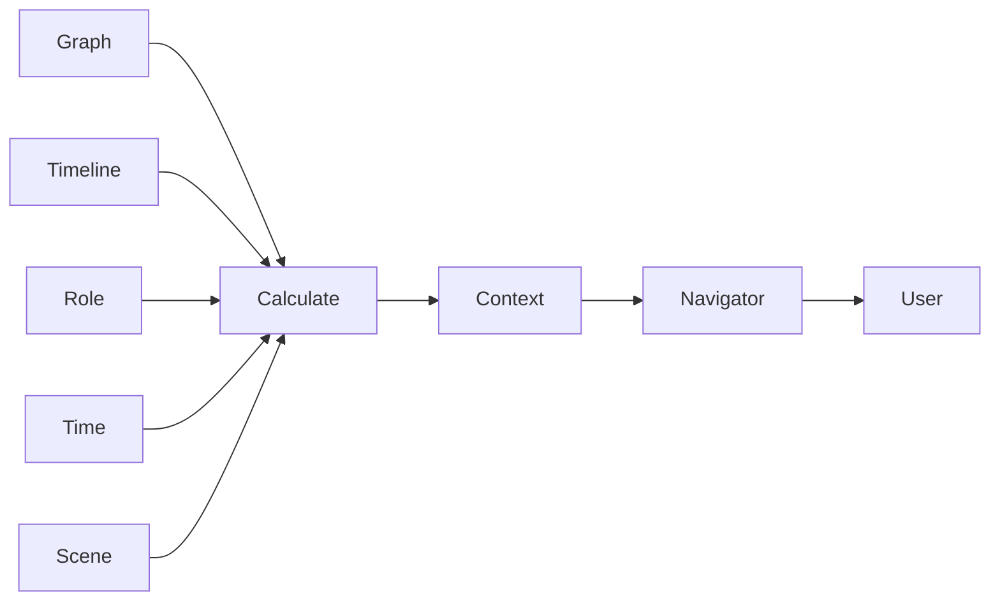
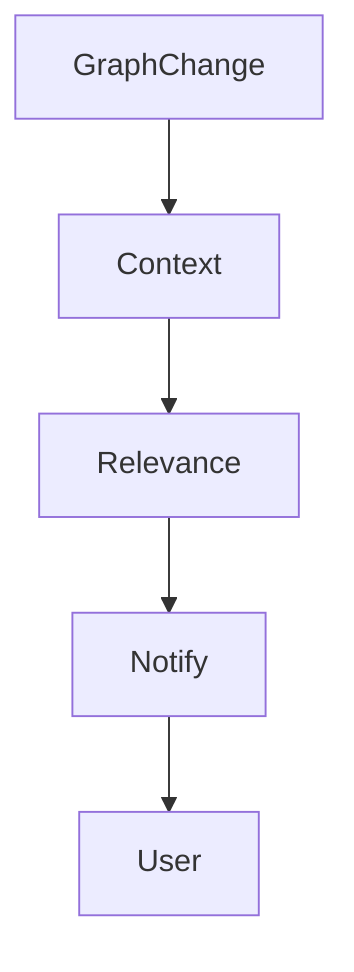
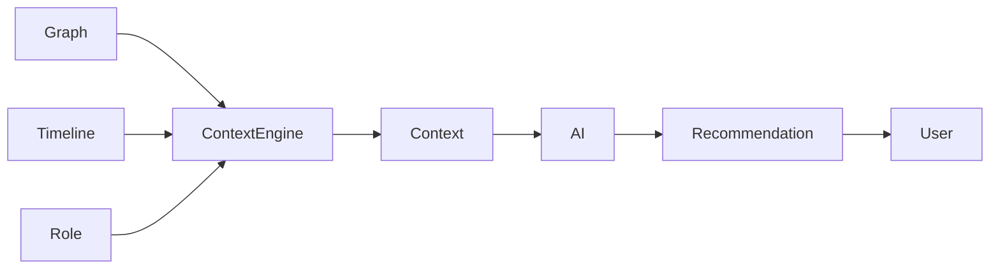

# Context Engine

**Document:** 12_Context_Engine.md  
**Version:** 0.1.0  
**Status:** Draft  
**Depends on:** 10_Architecture.md, 11_Graph_Model.md

---

# Purpose

Context Engine — центральный вычислительный компонент Event OS.

Именно он превращает граф события в персональное рабочее пространство каждого участника.

Все пользователи работают внутри одного проекта.

Но каждый видит собственный контекст.

---

# Philosophy

Большинство систем отвечают на вопрос:

> Что хранится в проекте?

Context Engine отвечает на другой вопрос:

> Что необходимо показать именно этому человеку именно сейчас?

Контекст является вычисляемой величиной.

Он никогда не хранится в базе данных в готовом виде.

---

# Definition

Контекст — это минимальный объем информации, необходимый пользователю для принятия следующего решения.

Контекст не равен:

- карточке проекта;
- таймлайну;
- документу;
- сообщению;
- задаче.

Он собирается динамически из множества объектов графа.

---

# Formula

В упрощенном виде вычисление контекста можно представить следующим образом.

```text
Context =
f(
    Event,
    Graph,
    Timeline,
    Scene,
    Role,
    Time,
    Location,
    State,
    History,
    Changes
)
```

---

# Input Sources

Context Engine использует несколько источников данных одновременно.



---

# Core Inputs

## Event

Текущее мероприятие.

Определяет пространство вычислений.

---

## Graph

Связи между объектами.

Позволяют определить:

- участников;
- зависимости;
- документы;
- маршруты;
- оборудование;
- коммуникации.

---

## Timeline

Позволяет определить:

- текущую сцену;
- предыдущую сцену;
- следующую сцену.

---

## Scene

Точка, внутри которой сейчас находится пользователь.

Именно Scene является главным контейнером контекста.

---

## Role

Роль определяет профессиональный взгляд пользователя.

Например.

Одна и та же сцена выглядит по-разному для:

- фотографа;
- ведущего;
- флориста;
- ресторана;
- координатора.

---

## Time

Контекст меняется во времени.

Одно и то же событие утром и вечером требует разной информации.

---

## Location

При наличии доступа к геопозиции система может понимать:

- пользователь уже приехал;
- пользователь опаздывает;
- пользователь находится далеко;
- пользователь покинул площадку.

Геопозиция никогда не является обязательной.

---

## State

Состояние объекта влияет на контекст.

Например.

```text
Preparation

↓

Ceremony

↓

Photo Walk

↓

Reception

↓

Finished
```

---

## History

История позволяет объяснить происходящее.

Не только:

> Что изменилось?

Но и:

> Почему изменилось?

---

## Changes

Последние изменения получают максимальный приоритет.

Даже если они относятся к объекту, который пользователь обычно не открывает.

---

# Context Lifecycle



Контекст пересчитывается автоматически.

---

# Context Triggers

Контекст обновляется при любом событии.

Например.

- изменение времени;
- изменение сцены;
- изменение маршрута;
- изменение роли;
- изменение погоды;
- новое сообщение;
- новый документ;
- изменение статуса;
- подключение нового участника;
- завершение задачи.

---

# Priority System

Каждый объект имеет собственный приоритет.

Например.

```
Critical

High

Normal

Low

Hidden
```

Контекст никогда не показывает одновременно все объекты.

Он сортирует их по важности.

---

# Relevance

Каждый объект получает оценку релевантности.

Условно.

```text
Relevance =
Role
+
Time
+
Distance
+
Dependencies
+
Recent Changes
+
Current Scene
```

Чем выше оценка, тем выше вероятность появления объекта в интерфейсе.

---

# Context Window

Пользователь всегда работает внутри ограниченного окна внимания.

```
Previous Scene

↓

Current Scene

↓

Next Scene
```

Система не должна перегружать пользователя информацией о событиях, которые еще слишком далеко.

---

# Navigator Model

Context Engine никогда не показывает весь маршрут.

Он показывает следующий участок.

```text
Current Position

↓

Current Context

↓

Next Action

↓

Next Context
```

Это соответствует принципу автомобильного навигатора.

---

# Different Contexts

## Photographer

Получает:

- адрес;
- парковку;
- маршрут;
- погоду;
- золотой час;
- список кадров;
- контакты;
- изменения маршрута;
- готовность клиента.

---

## Videographer

Получает:

- сценарий;
- движение между сценами;
- звук;
- интервью;
- оборудование.

---

## Host

Получает:

- программу;
- тайминг;
- готовность гостей;
- готовность кухни;
- начало музыкальных блоков.

---

## Florist

Получает:

- время монтажа;
- схему площадки;
- место хранения;
- время демонтажа.

---

## Client

Получает:

- статус подготовки;
- ближайшие этапы;
- документы;
- рекомендации;
- уведомления.

---

# Rescue Room

При открытии приложения пользователь должен сразу получить ответ на вопросы.

```
Где я?

Что происходит?

Что изменилось?

Что делать дальше?

Что может помешать?
```

Если хотя бы один вопрос остается без ответа — контекст вычислен неправильно.

---

# Context Expiration

Любая информация имеет срок актуальности.

Например.

```
Парковка ресторана

↓

актуальна вечером

---------------------

Погода на прогулке

↓

актуальна днем

---------------------

Контакт визажиста

↓

актуален утром
```

После завершения сцены информация автоматически теряет приоритет.

---

# Silent Context

Большинство объектов никогда не отображаются пользователю.

Они участвуют только в вычислениях.

Например.

- внутренние зависимости;
- история;
- технические связи;
- служебные объекты.

---

# Notifications

Уведомление является следствием изменения контекста.

Не любого изменения.

Только того, которое влияет на текущую работу пользователя.



---

# AI Integration

ИИ не вычисляет контекст.

Контекст вычисляет Context Engine.

ИИ получает уже вычисленный контекст.



Это позволяет полностью отключить ИИ без изменения архитектуры платформы.

---

# Performance Strategy

Контекст вычисляется быстро.

Он не должен требовать загрузки всего проекта.

Расчет выполняется относительно:

- текущей сцены;
- соседних сцен;
- связанных объектов.

Большая часть графа остается вне вычислений.

---

# Design Rules

При разработке новых функций необходимо соблюдать следующие правила.

## Context is computed.

Контекст никогда не хранится.

---

## Context is personal.

Не существует общего контекста проекта.

---

## Context is temporary.

Он изменяется непрерывно.

---

## Context is minimal.

Пользователь получает только необходимую информацию.

---

## Context is explainable.

Любой элемент интерфейса должен отвечать на вопрос:

> Почему я вижу это сейчас?

---

## Context reduces thinking.

Каждый новый экран должен уменьшать количество решений пользователя.

---

# Context Engine Statement

> **Context Engine — это сердце Event OS. Он непрерывно преобразует граф события, временную модель и роль пользователя в персональный рабочий контекст, позволяя каждому участнику видеть только ту информацию, которая необходима ему для принятия следующего решения.**
