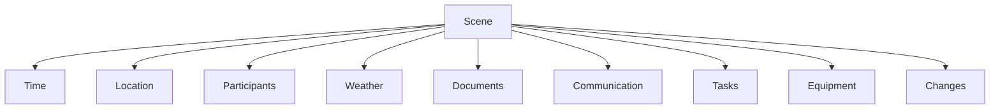
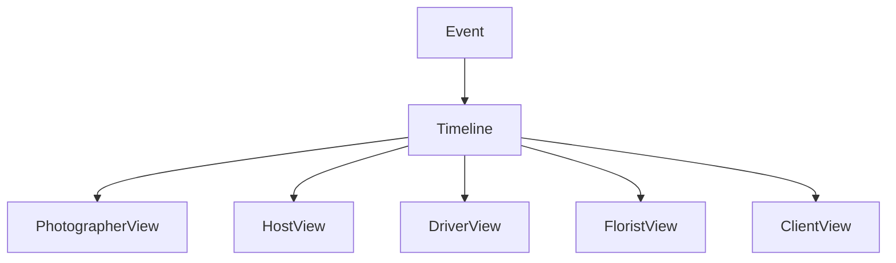
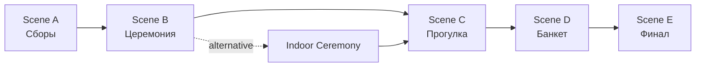
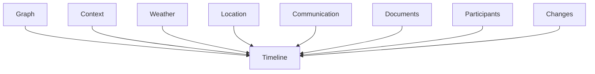

# Timeline Canvas

**Document:** 13_Timeline_Canvas.md  
**Version:** 0.1.0  
**Status:** Draft  
**Depends on:** 10_Architecture.md, 11_Graph_Model.md, 12_Context_Engine.md

---

# Purpose

Timeline Canvas — основная рабочая поверхность Event OS.

Он представляет мероприятие как последовательность времени, точек, сцен и переходов между ними.

Timeline не является обычным календарем или списком задач.

Он является визуальным представлением событийного графа во времени.

---

# Core Concept

Любое мероприятие можно представить как движение между точками.

```text
Start
  │
  ▼
Scene 1
  │
  ▼
Scene 2
  │
  ▼
Scene 3
  │
  ▼
Scene 4
  │
  ▼
Final
```

Между точками существует время.

Каждая точка имеет собственный контекст.

---

# Timeline Model

Базовая модель:

```text
Start Point
        │
        ▼
      Scene
        │
        ▼
      Scene
        │
        ▼
      Scene
        │
        ▼
    Final Point
```

Временная шкала является осью проекта.

```text
──────────────────────────────────────────────► time

09:00          11:30          14:00          18:00
  │              │              │              │
  ▼              ▼              ▼              ▼
Scene 1        Scene 2        Scene 3        Scene 4
```

---

# Timeline Is Not a Calendar

Календарь отвечает:

> Когда происходит событие?

Timeline отвечает:

> Что происходит сейчас, откуда мы пришли и куда движемся дальше?

Календарь работает с датами.

Timeline работает с непрерывным сценарием мероприятия.

---

# Timeline Is Not a Task List

Task Manager организует работу пользователя.

Timeline организует само событие.

Задача может существовать внутри Timeline, но Timeline не сводится к задачам.

```text
Scene
│
├── Participants
├── Location
├── Schedule
├── Weather
├── Documents
├── Communication
├── Tasks
├── Equipment
└── Changes
```

---

# Scene

Основной элемент Timeline — **Scene**.

Scene представляет собой конкретный этап мероприятия, имеющий:

- время;
- продолжительность;
- место;
- участников;
- состояние;
- связанные объекты.

Примеры:

```text
Сборы
Церемония
Прогулка
Фотосессия
Банкет
Первый танец
Торт
Финал
```

---

# Scene as Context Container

Scene является контейнером контекста.



При переходе пользователя к следующей сцене Context Engine пересчитывает его рабочий контекст.

---

# Scene States

Scene имеет жизненный цикл.

```text
Planned
   ↓
Confirmed
   ↓
Approaching
   ↓
Active
   ↓
Completed
   ↓
Archived
```

Состояние может изменяться автоматически на основании времени или вручную пользователем.

---

# Current Scene

В любой момент Timeline имеет одну текущую сцену для конкретного участника.

```text
Previous ← Current → Next
```

Это не обязательно одна и та же сцена для всех участников.

Фотограф может находиться в `Photo Session`.

Ведущий — в `Reception`.

Водитель — на маршруте между двумя сценами.

---

# Personal Timeline

Один Event имеет один общий Timeline.

Но каждый пользователь получает собственное представление этого Timeline.



Это не разные расписания.

Это разные проекции одного графа.

---

# Relevance

Timeline не обязан показывать все сцены одинаково подробно.

Чем дальше сцена находится от текущего момента, тем меньше контекста отображается.

```text
PAST             NOW                 FUTURE

completed       current             upcoming
───────────     ───────────          ───────────
minimal         maximum              relevant
detail          context              preview
```

---

# Context Window

Основная рабочая область пользователя должна концентрироваться вокруг:

```text
Previous Scene
       ↓
Current Scene
       ↓
Next Scene
```

Дальнейшие сцены доступны, но не конкурируют за внимание.

---

# Time Distance

Информация должна раскрываться постепенно.

Например:

```text
Через 8 часов
→ только название сцены

Через 2 часа
→ время + место

Через 30 минут
→ время + место + маршрут

Через 5 минут
→ полный рабочий контекст

Сейчас
→ текущие действия и изменения
```

Конкретные интервалы зависят от типа сцены и роли пользователя.

---

# Transitions

Важна не только точка назначения.

Важен переход между точками.

```text
Scene A
   │
   │ travel
   │
   ▼
Scene B
```

Transition может содержать:

- маршрут;
- транспорт;
- продолжительность;
- пробки;
- парковку;
- время выезда;
- ответственного;
- альтернативный маршрут.

---

# Navigation

Timeline должен позволять пользователю понимать:

```text
Где я?

↓

Куда я направляюсь?

↓

Когда нужно двигаться?

↓

Что произойдет после прибытия?
```

Это связывает Timeline с Navigator.

---

# Dynamic Timeline

Timeline не является статичным документом.

Он постоянно меняется.

Причины:

- изменение времени;
- изменение места;
- изменение маршрута;
- изменение участников;
- изменение погоды;
- изменение программы;
- отмена сцены;
- добавление сцены;
- изменение зависимостей.

После любого изменения связанные контексты пересчитываются автоматически.

---

# Example: Route Change

Исходный маршрут:

```text
Hotel
   ↓
Registry Office
   ↓
Restaurant
```

Возникло ограничение движения.

Система получает изменение:

```text
Road blocked
```

Граф изменяется:

```text
Hotel
   ↓
Alternative Route
   ↓
Registry Office
   ↓
Restaurant
```

Context Engine определяет затронутых участников.

Фотограф получает:

```text
Маршрут изменен.

До ЗАГСа: 24 мин.

Выезд в 11:05.
```

Ведущий не получает это уведомление, если изменение не влияет на его работу.

---

# Example: Weather Change

Исходный план:

```text
14:00
Outdoor Ceremony
```

Прогноз изменился.

Система не должна автоматически отменять церемонию.

Она должна показать организатору:

```text
Высокая вероятность дождя.

Есть альтернативная сцена:
Indoor Ceremony
```

После подтверждения организатором Timeline изменяется.

Все связанные контексты пересчитываются.

---

# Parallel Scenes

Мероприятие может содержать параллельные процессы.

Например:

```text
                    ┌── Photographer
                    │
Bride Preparation ──┼── Makeup
                    │
                    └── Video Team
```

Или:

```text
                ┌── Decor Setup
                │
Venue Setup ────┼── Sound Check
                │
                └── Catering
```

Timeline должен поддерживать несколько одновременно активных веток.

---

# Timeline Graph

Timeline является временной проекцией графа.



Граф хранит связи.

Timeline визуализирует последовательность.

---

# Dependencies

Сцены могут зависеть друг от друга.

```text
Ceremony
   ↓
depends_on
   ↓
Venue Ready
```

или:

```text
Photo Session
   ↓
depends_on
   ↓
Golden Hour
```

Изменение зависимости может изменить контекст сцены.

---

# Weather Layer

Погода является временным слоем Timeline.

```text
09:00      12:00      15:00      18:00
  ☀          ☁          ☔          ☀
```

Погода не должна превращать Timeline в метеорологическое приложение.

Она отображается только там и тогда, где влияет на событие.

---

# Light Layer

Для мероприятий, где свет является частью рабочего процесса, Timeline может содержать:

- sunrise;
- sunset;
- golden hour;
- blue hour;
- darkness.

Особенно важно для:

- фотографов;
- видеографов;
- outdoor-сцен;
- декораторов;
- световых команд.

Свет является контекстом, а не отдельным календарем.

---

# Changes Layer

Timeline должен явно показывать изменения.

```text
✓ Planned

⚠ Changed

✕ Cancelled

+ Added
```

Изменение должно быть связано с причиной и временем изменения.

---

# History

Каждая сцена сохраняет историю.

```text
14:00 — Outdoor Ceremony
↓
14:00 — Location changed
↓
14:15 — Indoor Ceremony
↓
14:20 — Participants notified
```

История не должна перегружать основной интерфейс.

Она доступна по запросу.

---

# Timeline Interaction

Основные действия:

- создать сцену;
- изменить сцену;
- переместить сцену;
- изменить продолжительность;
- связать участников;
- добавить зависимость;
- изменить место;
- добавить альтернативу;
- отменить;
- восстановить;
- открыть контекст.

Все изменения проходят через единый граф.

---

# Timeline and Communication

Каждая сцена имеет собственную коммуникацию.

```text
Scene
│
├── Information
├── Documents
├── Tasks
├── Chat
└── History
```

Сообщение, отправленное внутри сцены, автоматически получает контекст сцены.

---

# Timeline and Files

Файлы могут быть привязаны к сценам.

Например:

```text
Scene: Photo Session

├── Shot List
├── Moodboard
├── Location Photos
├── References
└── Lighting Plan
```

---

# Timeline and Postproduction

Timeline не заканчивается моментом окончания мероприятия.

Для некоторых ролей он продолжается после события.

Например:

```text
Wedding Day
    ↓
RAW Transfer
    ↓
Selection
    ↓
Retouch
    ↓
Review
    ↓
Gallery
    ↓
Client Delivery
```

Для фотографа и видеографа это часть жизненного цикла проекта.

---

# Timeline and Temporary Participants

Временный участник подключается только к релевантным сценам.

Например:

```text
Driver

11:00 → Pickup
12:00 → Transfer
13:00 → Waiting
14:30 → Departure
```

Ему не требуется видеть весь проект.

---

# Timeline and Clients

Клиент получает упрощенную проекцию Timeline.

Например:

```text
✓ Contract
✓ Planning

● Wedding Preparation

○ Wedding Day

○ Photos

○ Photo Book
```

Клиент не должен видеть внутреннюю операционную структуру команды.

---

# Desktop Timeline

На компьютере Timeline является инструментом подготовки и управления.

Desktop позволяет:

- видеть полный проект;
- создавать сцены;
- связывать объекты;
- редактировать расписание;
- управлять командами;
- анализировать зависимости;
- просматривать историю.

---

# Mobile Timeline

На мобильном устройстве Timeline является инструментом навигации.

Он должен позволять быстро определить:

- текущую сцену;
- следующую сцену;
- время;
- место;
- маршрут;
- изменения;
- необходимые действия.

---

# PWA Requirements

Timeline должен быть доступен через PWA.

Основные требования:

- быстрый запуск;
- адаптивный интерфейс;
- offline-доступ к текущему контексту;
- синхронизация после восстановления сети;
- push notifications;
- работа на iOS;
- работа на Android;
- работа в desktop browser.

---

# Timeline Does Not Own Business Logic

Timeline является представлением.

Он не должен самостоятельно определять:

- права доступа;
- финансовые статусы;
- роли;
- уведомления;
- AI-рекомендации;
- бизнес-правила.

Эти функции принадлежат соответствующим доменам.

Timeline только представляет результат их работы.

---

# Timeline as Operating Surface

Timeline объединяет:



Поэтому Timeline является главным рабочим пространством Event OS.

---

# Design Rules

## Time is primary

Временная последовательность является основой представления события.

---

## Scene is the unit

Сцена является основной рабочей единицей Timeline.

---

## Context is dynamic

Содержимое сцены изменяется в зависимости от времени и роли.

---

## Future is compressed

Далекие события не должны конкурировать с текущим контекстом.

---

## Changes are visible

Критические изменения должны быть заметны сразу.

---

## Transitions matter

Перемещение между сценами является частью Timeline.

---

## One Event, many projections

Все пользователи работают с одним Timeline.

Каждый получает собственную проекцию.

---

# Timeline Statement

> **Timeline Canvas — это временная проекция графа мероприятия, которая превращает сложный многосвязный проект в понятный маршрут через последовательность сцен, предоставляя каждому участнику собственный контекст движения по этому маршруту.**
