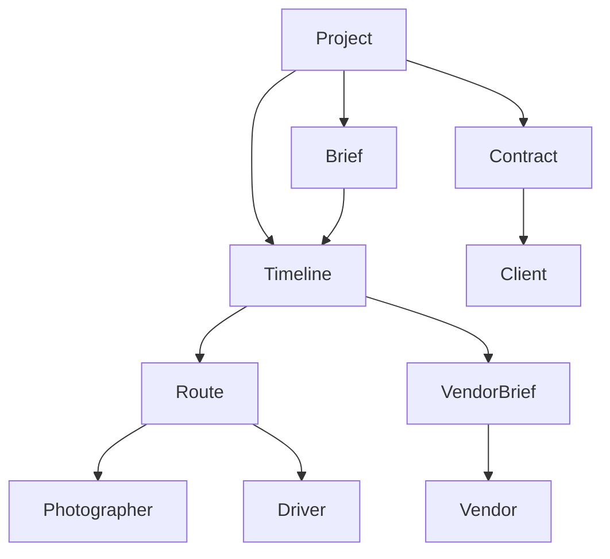

**Document:** `25_Documents.md`
**Version:** `0.1.0`
**Status:** Draft
**Depends on:**

* `10_Architecture.md`
* `11_Graph_Model.md`
* `12_Context_Engine.md`
* `20_Workspaces.md`
* `21_Projects.md`
* `22_Roles.md`
* `23_Permissions.md`
* `24_Communication.md`

---

## 1. Purpose

Documents — слой структурированной информации проекта.

Документ отличается от сообщения тем, что сообщение фиксирует коммуникацию, а документ хранит **устойчивую информацию**, на которую участники должны опираться.

```text
Message
    ↓
Communication

Document
    ↓
Source of Project Information
```

Примеры:

* договор;
* бриф;
* маршрутный лист;
* тайминг;
* техническое задание;
* смета;
* список гостей;
* меню;
* технический райдер;
* сценарий;
* список контактов;
* требования площадки;
* памятка исполнителю.

---

# 2. Core Principle

> **Документ существует не ради документа. Он существует как структурированная часть графа проекта.**

Документ должен быть связан с:

```text
Project
Client
Team
Role
Scene
Task
Timeline
Location
Vendor
Contract
```

---

# 3. Documents vs Messages

Сообщение:

```text
«Завтра встречаемся в 12:00»
```

Документ:

```text
Meeting
Date: tomorrow
Time: 12:00
Location: ...
Participants: ...
```

Сообщение может сообщить об изменении документа:

```text
«Встречу перенесли на 13:00»
```

После подтверждения:

```text
Document / Timeline
12:00 → 13:00
```

---

# 4. Documents vs Database

Не вся информация должна быть документом.

Если система знает:

```text
Client.name
Project.date
Scene.start
Vendor.phone
Task.status
```

это структурированные данные.

Документ нужен для:

```text
Narrative
Instructions
Agreements
Briefs
Plans
Long-form information
```

---

# 5. Structured Data First

Архитектурный принцип:

> **Если данные используются системой для логики, они должны существовать структурированно, а не только внутри текста документа.**

Например, не:

```text
«Свадьба начинается примерно в 15 часов»
```

а:

```text
event.start_time = 15:00
```

Документ может содержать человеческое описание, но система работает со структурированными данными.

---

# 6. Document Types

Базовая классификация:

```text
Brief
Contract
Estimate
Timeline
Route
Technical Rider
Scenario
Guest List
Vendor Specification
Client Requirements
Checklist
Instruction
Report
Memo
Gallery Delivery
Invoice Reference
Legal Document
```

Список расширяемый.

---

# 7. Document Categories

Документы можно группировать:

```text
Planning
Production
Legal
Financial
Communication
Technical
Client
Postproduction
Delivery
```

---

# 8. Planning Documents

Например:

* бриф;
* концепция мероприятия;
* план подготовки;
* тайминг;
* маршрут;
* список задач;
* план площадки.

---

# 9. Production Documents

Например:

* сценарий;
* технический райдер;
* монтажный план;
* план света;
* план звука;
* схема площадки;
* production checklist.

---

# 10. Legal Documents

Например:

* договор;
* приложение к договору;
* согласие;
* акт;
* оферта;
* пользовательское соглашение;
* политика организации.

Юридический документ не должен автоматически означать юридическую квалификацию системой.

---

# 11. Financial Documents

Например:

* смета;
* коммерческое предложение;
* внутренний бюджет;
* список расходов;
* счет;
* финансовый отчет.

Система может хранить финансовые статусы:

```text
paid
unpaid
partially_paid
```

но наличие Documents Module не превращает продукт в бухгалтерскую систему.

---

# 12. Accounting Boundary

Система не является:

* налоговой;
* бухгалтерской системой;
* банком;
* платежным сервисом.

Не требуется:

```text
Acquiring
Payment Gateway
Online Cash Register
Bank Processing
```

Документы могут содержать финансовую информацию, необходимую для управления проектом.

---

# 13. Document Ownership

Документ может принадлежать:

```text
Organization
Project
Team
User
Client
Vendor
```

Пример:

```text
Organization
    └── Internal Policy
```

или:

```text
Project
    └── Wedding Brief
```

---

# 14. Document Scope

Документ должен иметь scope:

```text
Organization
Project
Team
Scene
Task
Client
Vendor
```

---

# 15. Document Visibility

Базовые режимы:

```text
Private
Team
Project
Client
External
Public
```

---

# 16. Private Document

Виден только автору или явно назначенным пользователям.

Например:

```text
Personal Notes
Internal Preparation
Private Evaluation
```

---

# 17. Team Document

Доступен конкретной команде.

Например:

```text
Photo Team Brief
```

---

# 18. Project Document

Доступен участникам проекта в соответствии с permissions.

Например:

```text
Wedding Timeline
```

---

# 19. Client Document

Создан для клиента.

Например:

```text
Preparation Guide
Wedding Schedule
Client Brief
```

---

# 20. External Document

Документ предназначен для конкретного внешнего исполнителя.

Например:

```text
Driver Instructions
Venue Technical Requirements
```

---

# 21. Public Document

Редкий режим.

Например:

```text
Public Event Information
```

Публичность должна включаться явно.

---

# 22. Document Permissions

Используются permissions из `23_Permissions.md`.

Минимально:

```text
READ_DOCUMENT
CREATE_DOCUMENT
UPDATE_DOCUMENT
DELETE_DOCUMENT
SHARE_DOCUMENT
EXPORT_DOCUMENT
ARCHIVE_DOCUMENT
```

Дополнительно:

```text
APPROVE_DOCUMENT
PUBLISH_DOCUMENT
SIGN_DOCUMENT
```

---

# 23. Read ≠ Edit

Пользователь может:

```text
READ_DOCUMENT
```

но не иметь:

```text
UPDATE_DOCUMENT
```

Например:

```text
Photographer
READ Timeline
```

но:

```text
Organizer
UPDATE Timeline
```

---

# 24. Read ≠ Export

Пользователь может видеть документ внутри системы, но не иметь права выгружать его.

Это особенно важно для:

* договоров;
* клиентских данных;
* финансовой информации;
* внутренних документов.

---

# 25. Document Lifecycle

```text
Draft
 ↓
Review
 ↓
Approved
 ↓
Published
 ↓
Active
 ↓
Archived
```

Не все документы проходят все состояния.

---

# 26. Draft

Документ создается.

```text
status = draft
```

Он ещё не является источником истины для проекта.

---

# 27. Review

Документ передан на проверку.

Например:

```text
Organizer
    ↓
Client
```

или:

```text
Coordinator
    ↓
Organizer
```

---

# 28. Approved

Документ подтвержден.

```text
status = approved
```

---

# 29. Published

Документ становится доступен определенной аудитории.

```text
status = published
```

---

# 30. Active

Документ используется в текущем процессе.

Например:

```text
Current Timeline
Current Route
Current Technical Plan
```

---

# 31. Archived

Документ больше не является актуальным.

Он сохраняется для истории.

---

# 32. Versioning

Документы должны поддерживать версии.

```text
Document
│
├── v1
├── v2
├── v3
└── current
```

---

# 33. Version Is Immutable

После публикации версия не изменяется.

Изменение создает новую версию.

```text
v3
 ↓
edit
 ↓
v4
```

---

# 34. Why Versioning Matters

Например:

```text
10:00
Route v4

12:30
Route v5
```

Фотограф должен понимать:

> какой маршрут был актуальным в момент его работы.

---

# 35. Current Version

У документа всегда есть:

```text
current_version
```

Но история доступна для аудита.

---

# 36. Version Metadata

```text
DocumentVersion
│
├── id
├── document_id
├── version
├── author
├── created_at
├── change_summary
├── status
└── snapshot
```

---

# 37. Change Summary

Каждая версия должна иметь краткое описание.

Например:

```text
v5
Изменено:
- ресторан вместо фотостудии;
- время переезда 18:20;
- добавлен водитель.
```

---

# 38. Document Diff

Система должна уметь показывать изменения между версиями.

```text
v4 → v5
```

Например:

```text
Location:
Old: Studio
New: Restaurant

Time:
Old: 17:30
New: 18:00
```

---

# 39. Important Changes

Не каждое изменение требует уведомления.

Изменение:

```text
typo
```

может быть незаметным.

Изменение:

```text
Timeline
Location
Client
Assignment
Deadline
```

может создавать Communication Event.

---

# 40. Document Change Propagation

```text
Document Update
 ↓
Change Detection
 ↓
Affected Graph Nodes
 ↓
Affected Users
 ↓
Communication Event
 ↓
Notification
```

---

# 41. Document and Timeline

Timeline является специальным документом только на уровне представления.

Фактические Timeline Nodes должны храниться структурированно.

```text
Timeline
 ↓
Scene Nodes
 ↓
Time
Location
Participants
Dependencies
```

Документ Timeline может быть экспортным представлением этих данных.

---

# 42. Document and Graph

Документ является node или контейнером nodes графа.

```text
Project
 ↓
Document
 ↓
References
 ↓
Graph Nodes
```

---

# 43. Document References

Документ может ссылаться на:

```text
Client
Vendor
Scene
Task
Location
Timeline
File
Message
Contract
```

---

# 44. Smart References

Ссылка должна быть не просто URL.

Например:

```text
[Сцена: Прогулка]
```

содержит:

```text
scene_id
```

При открытии пользователь попадает в актуальное состояние Scene.

---

# 45. Embedded Objects

Документ может содержать встроенные объекты:

```text
Timeline
Map
Checklist
Task List
Contact
Gallery
```

Это позволяет сделать документ интерактивным.

---

# 46. Document Editor

Редактор должен поддерживать:

```text
Text
Headings
Lists
Tables
Images
Files
Links
Mentions
References
Structured Blocks
```

Но редактор не должен становиться отдельной сложной CMS.

---

# 47. Block Model

Рекомендуемая модель:

```text
Document
 ↓
Blocks
```

Пример:

```text
Document
├── Heading
├── Paragraph
├── TimelineBlock
├── LocationBlock
├── ContactBlock
├── ChecklistBlock
└── NoteBlock
```

---

# 48. Structured Blocks

Особенно важны блоки, которые связаны с системой.

Например:

```text
<timeline scene="12">
```

или:

```text
<contact vendor="34">
```

Они отображаются как человеческие элементы, но имеют структурированную связь с графом.

---

# 49. Documents as Views

Некоторые документы могут быть представлениями существующих данных.

Например:

```text
Route Sheet
```

не обязательно хранить отдельно.

Он может быть:

```text
Graph Data
 ↓
Route Sheet View
```

---

# 50. Source of Truth

Нужно различать:

```text
Source of Truth
```

и:

```text
Generated Document
```

Например:

```text
Timeline Graph
    ↓
PDF Route Sheet
```

PDF является snapshot, а Timeline остаётся источником истины.

---

# 51. Generated Documents

Система может генерировать:

* PDF;
* printable route;
* client guide;
* vendor brief;
* schedule;
* checklist;
* report.

---

# 52. Export

Export может быть:

```text
PDF
CSV
DOCX
JSON
ICS
```

Конкретный набор зависит от продукта.

---

# 53. Calendar Export

Timeline может экспортироваться в календарь.

Например:

```text
ICS
```

Но импорт/экспорт не должен разрушать внутреннюю модель графа.

---

# 54. Print View

Для некоторых ролей бумажная версия остается полезной.

Особенно:

* водитель;
* координатор;
* технический персонал;
* ведущий.

Print View должен быть оптимизирован под роль.

---

# 55. Role-Specific Documents

Один Project может иметь разные представления.

Например:

```text
Full Timeline
```

для организатора.

```text
Photographer Route Sheet
```

для фотографа.

```text
Driver Route
```

для водителя.

```text
Host Program
```

для ведущего.

Все они могут строиться из одного графа.

---

# 56. One Source → Many Views

```text
                 Graph
                   │
        ┌──────────┼──────────┐
        ↓          ↓          ↓
   Organizer   Photographer  Driver
     View         View         View
```

Это один из ключевых принципов системы.

---

# 57. Document Templates

Организация может создавать шаблоны.

Например:

```text
Wedding Brief
Corporate Event Brief
Birthday Brief
Photo Session Brief
Technical Rider
```

---

# 58. Template Variables

Шаблон может содержать:

```text
{{client.name}}
{{project.date}}
{{venue.name}}
{{photographer.name}}
{{timeline}}
```

При создании проекта они заменяются актуальными данными.

---

# 59. Template Inheritance

Организация может иметь:

```text
Global Template
 ↓
Agency Template
 ↓
Project Template
```

---

# 60. Agency Branding

Организация может иметь минимальную айдентику:

```text
Logo
Primary Color
Secondary Color
Name
Contacts
```

Документы могут использовать эту айдентику.

---

# 61. Client-Facing Documents

Клиент должен получать документы в понятном виде.

Например:

```text
Wedding Guide
│
├── Date
├── Locations
├── Schedule
├── Contacts
├── Important Information
└── Preparation
```

Без внутренних сущностей CRM.

---

# 62. Internal Documents

Внутренние документы могут содержать:

* бюджет;
* маржинальность;
* подрядчиков;
* внутренние комментарии;
* конфликтующие варианты;
* организационные заметки.

Они не должны попадать в Client Workspace.

---

# 63. Document Access for One-Day Workers

Однодневному исполнителю может быть доступна только конкретная инструкция.

Например:

```text
Driver Instructions
```

Он не должен видеть:

```text
Full Project Documentation
```

---

# 64. Document Delivery

Документ может быть передан пользователю:

```text
Share
 ↓
Permission
 ↓
Notification
```

---

# 65. Document Acknowledgement

Для критических инструкций можно использовать:

```text
ACKNOWLEDGED
```

Например:

```text
Driver Instructions
→ Driver
→ Read
→ Acknowledged
```

---

# 66. Required Documents

Project может иметь требования:

```text
Required Documents
```

Например:

```text
Contract
Client Brief
Venue Requirements
Technical Rider
```

Статус:

```text
Missing
Draft
Ready
Approved
Expired
```

---

# 67. Document Dependencies

Документы могут зависеть друг от друга.

Например:

```text
Client Brief
 ↓
Timeline
 ↓
Vendor Brief
 ↓
Route Sheet
```

Если Client Brief изменился, система может определить потенциально затронутые документы.

---

# 68. Stale Documents

Документ может стать устаревшим.

Например:

```text
Timeline changed
 ↓
Route Sheet generated yesterday
 ↓
STALE
```

Система должна показать:

```text
Документ устарел.
Есть новая версия Timeline.
```

---

# 69. Document Freshness

Документ может иметь:

```text
current
stale
expired
archived
```

---

# 70. Automatic Invalidation

Некоторые документы должны автоматически помечаться устаревшими при изменении source data.

Например:

```text
Timeline changed
 ↓
Route Sheet → stale
Vendor Brief → stale
Driver Sheet → stale
```

---

# 71. Document Regeneration

Для generated documents:

```text
Source changed
 ↓
Regenerate
 ↓
New Version
```

---

# 72. Document and Communication

Документы и сообщения должны быть взаимосвязаны.

Сообщение:

```text
«Обновил маршрут»
```

может содержать:

```text
[Route Sheet v5]
```

---

# 73. Document Change Message

При публикации новой версии:

```text
SYSTEM

Маршрутный лист обновлен до версии 5.

Изменения:
• новая точка съемки;
• изменено время переезда;
• добавлен водитель.
```

---

# 74. Document Comments

Комментарии могут существовать внутри документа.

Но комментарий — это Communication Object.

```text
Document
 ↓
Comment
 ↓
Message
```

---

# 75. Document Mentions

Можно упоминать пользователей:

```text
@Фотограф
```

в конкретном месте документа.

---

# 76. Document Tasks

Из документа можно создать Task.

Например:

```text
«Уточнить парковку у площадки»
```

→

```text
Task
Assignee: Coordinator
Deadline: Tomorrow
```

---

# 77. Document AI

AI может помогать:

* создавать черновики;
* структурировать документы;
* искать противоречия;
* делать summary;
* извлекать задачи;
* сравнивать версии;
* находить устаревшие документы.

---

# 78. AI Optional

Без AI пользователь должен иметь возможность:

```text
Create
Edit
Review
Approve
Publish
Archive
```

все документы вручную.

---

# 79. AI and Permissions

AI получает только документы, доступные пользователю.

```text
User
 ↓
Permissions
 ↓
Allowed Documents
 ↓
AI
```

---

# 80. AI Must Not Invent

AI не должен создавать факты.

Если в документе отсутствует:

```text
Time
Location
Contact
```

AI должен обозначить отсутствие данных.

Не:

```text
«Встреча в 10:00»
```

если это нигде не указано.

---

# 81. Document Conflict Detection

Система может обнаруживать противоречия.

Например:

```text
Timeline:
Ceremony 15:00

Vendor Brief:
Ceremony 15:30
```

Система показывает:

```text
CONFLICT
```

---

# 82. Conflict Resolution

Система не должна самостоятельно выбирать источник истины без правила.

Она предлагает:

```text
Обнаружено противоречие.

Timeline:
15:00

Vendor Brief:
15:30

Выберите актуальное значение.
```

---

# 83. Document Expiration

Некоторые документы имеют срок действия.

Например:

```text
Insurance
Permit
Contract
Technical Certificate
```

Модель:

```text
valid_from
valid_until
```

---

# 84. Document Metadata

Минимально:

```text
Document
│
├── id
├── title
├── type
├── category
├── owner
├── project
├── visibility
├── status
├── current_version
├── created_at
├── updated_at
├── expires_at
└── archived_at
```

---

# 85. Document Version Model

```text
DocumentVersion
│
├── id
├── document_id
├── version_number
├── author
├── content
├── created_at
├── change_summary
├── checksum
└── status
```

---

# 86. Document Reference Model

```text
DocumentReference
│
├── document_id
├── target_type
├── target_id
├── relation
└── metadata
```

Например:

```text
Document
 ↓
references
 ↓
Scene #14
```

---

# 87. Document Relations

Поддерживаемые связи:

```text
references
derived_from
depends_on
supersedes
attached_to
generated_from
approved_by
owned_by
```

---

# 88. Supersedes

Например:

```text
Route v5
    supersedes
Route v4
```

Старый документ сохраняется.

---

# 89. Derived From

Например:

```text
Photographer Route Sheet
    derived_from
Timeline
```

---

# 90. Generated From

Например:

```text
PDF Client Guide
    generated_from
Project Graph
```

---

# 91. Document Storage

Документ может содержать:

```text
Structured Content
+
Attachments
+
Metadata
```

Файлы должны храниться отдельно от metadata.

---

# 92. File vs Document

Важно:

```text
File
```

и:

```text
Document
```

не одно и то же.

Файл:

```text
route.pdf
```

Документ:

```text
Route Sheet
version 5
status active
generated from Timeline
```

Файл является представлением документа.

---

# 93. Storage Model

```text
Document
   ↓
Document Version
   ↓
Content
   ↓
Attachments
   ↓
Storage
```

---

# 94. Offline

PWA должна позволять работать с документами offline там, где это необходимо.

Например:

* водитель может открыть маршрут;
* фотограф может открыть маршрутный лист;
* координатор может открыть тайминг.

---

# 95. Offline Restrictions

Изменения offline должны синхронизироваться после восстановления соединения.

Для критических документов необходимо разрешать только безопасные операции.

---

# 96. Conflict Resolution

Если два пользователя изменили документ одновременно:

```text
Version 5
 ├── User A → Version 6A
 └── User B → Version 6B
```

система не должна молча уничтожать одну версию.

Она должна:

```text
Merge
или
Resolve Conflict
```

---

# 97. Document Locking

Для некоторых документов возможно временное редактирование:

```text
Editing
 ↓
Lock
 ↓
Save
 ↓
Unlock
```

Но глобальная блокировка должна использоваться осторожно.

---

# 98. Audit

Для важных документов сохраняется:

```text
Created
Edited
Viewed
Shared
Approved
Published
Archived
Exported
```

---

# 99. Document Security

Особое внимание:

* договорам;
* финансовым документам;
* персональным данным;
* клиентским данным;
* паспортным данным, если они вообще используются;
* внутренним документам организации.

---

# 100. Personal Data

Документы могут содержать персональные данные.

Система должна придерживаться принципа:

> хранить только те данные, которые действительно необходимы для работы проекта.

Не следует превращать Documents в универсальное хранилище персональных данных.

---

# 101. Legal Boundary

Система предоставляет:

```text
Document Management
```

а не:

```text
Legal Advice
Accounting
Tax Compliance
```

Документы могут использоваться в юридических процессах, но система не должна самостоятельно утверждать их юридическую силу.

---

# 102. Document Workspace

В Workspace пользователь видит не все документы Project.

Он видит:

```text
Relevant Documents
```

Например:

```text
Photographer
│
├── Route Sheet
├── Timeline
├── Client Brief
├── Shot List
└── Location Notes
```

Водитель:

```text
Driver
│
├── Route
├── Pickup List
├── Parking Instructions
└── Emergency Contacts
```

---

# 103. Document Context

Документ может появляться автоматически в нужном контексте.

Например:

```text
Navigator
 ↓
Next Scene
 ↓
Relevant Documents
```

Фотографу показывается:

```text
Location Brief
Shot List
Client Notes
```

а не:

```text
Agency Contract
Budget
Internal Organizer Notes
```

---

# 104. Document Inbox

Можно иметь отдельный список:

```text
Documents requiring attention
```

Например:

```text
3 documents
├── Client Brief — review
├── Vendor Contract — missing
└── Route Sheet — outdated
```

---

# 105. Document Dashboard

Для организатора:

```text
Documents

Required: 24
Ready: 19
Needs Review: 3
Missing: 2
Outdated: 1
```

---

# 106. Document Graph



---

# 107. Example: Wedding

```text
Project
│
├── Client Brief
│
├── Contract
│
├── Budget
│
├── Timeline
│   ├── Preparation
│   ├── Ceremony
│   ├── Transfer
│   ├── Photo Session
│   └── Dinner
│
├── Route Sheet
│
├── Vendor Briefs
│   ├── Photographer
│   ├── Videographer
│   ├── Driver
│   ├── Host
│   ├── Decorator
│   └── Sound
│
└── Client Guide
```

---

# 108. Example: Photographer

Фотограф подключается к проекту поздно.

Система не показывает ему весь архив.

Она собирает:

```text
Photographer Context
│
├── Client
├── Date
├── Timeline
├── Locations
├── Route
├── Light
├── Weather
├── Relevant Vendor Contacts
├── Shot List
└── Recent Changes
```

---

# 109. Example: Driver

```text
Driver Context
│
├── Today
├── Route
├── Pickup
├── Dropoff
├── Passengers
├── Contact Organizer
└── Changes
```

---

# 110. Example: Client

```text
Client Context
│
├── Event
├── Schedule
├── Locations
├── Preparation
├── Contacts
├── Documents
└── Messages
```

---

# 111. Documents and the "Rescue Room"

Documents должны поддерживать идею:

> **Открой систему и найди то, что тебе нужно сейчас.**

Не:

```text
Project
 → Documents
 → 74 files
 → search
```

а:

```text
Now
 ↓
Relevant Context
 ↓
Relevant Documents
```

---

# 112. Document Retrieval

Context Engine должен определять:

```text
Current User
Current Role
Current Project
Current Scene
Current Time
Upcoming Scene
Relevant Changes
```

и выбирать документы.

---

# 113. Contextual Document Ranking

Приоритет:

```text
Current Scene
↓
Next Scene
↓
Current Task
↓
Recent Changes
↓
Upcoming Work
↓
General Project Documents
```

---

# 114. Document Notifications

Не уведомлять:

> «Документ обновлен»

без контекста.

Лучше:

> «Маршрут фотографа изменен. Новая точка после ЗАГСа — ресторан.»

---

# 115. Document Notification Rules

Notification создается, если:

```text
Document Changed
AND
User is affected
AND
User has permission
AND
Change is relevant
```

---

# 116. Document System and Navigator

Navigator может показывать:

```text
Через 150 м — поворот направо.

Маршрут обновлен 5 минут назад.

[Открыть маршрут]
```

Это лучше, чем:

```text
Новый документ Route Sheet v5
```

---

# 117. Document System and Communication

Communication сообщает:

```text
что изменилось
```

Documents хранят:

```text
что сейчас является актуальным
```

Timeline/Graph хранит:

```text
структурированную реальность проекта
```

---

# 118. Three-Layer Model

```text
Communication
    ↓
Что произошло?

Documents
    ↓
Что записано?

Graph
    ↓
Что является структурированным состоянием проекта?
```

---

# 119. Source of Truth Hierarchy

Для каждого типа данных должен быть определен источник истины.

Например:

```text
Event Time
→ Timeline

Client Name
→ Client Entity

Vendor Phone
→ Vendor Entity

Contract
→ Contract Document

Discussion
→ Communication

Route PDF
→ Generated View
```

---

# 120. No Duplicate Truth

Нельзя одновременно считать источниками истины:

```text
Timeline
и
PDF Route Sheet
```

Если они расходятся, система должна знать, какой объект главный.

---

# 121. Document Rules

## Structured First

Системные данные хранятся структурированно.

## Document Is Context

Документ связан с графом.

## Version Everything Important

Опубликованные документы не изменяются задним числом.

## Current Source Matters

У каждого документа должен быть понятный актуальный источник.

## Generated Views Are Not Truth

PDF и печатные версии являются представлениями.

## Permissions Always Apply

Документ не обходят permissions.

## Client Isolation

Внутренние документы не попадают клиенту.

## Temporary Access

Однодневный исполнитель получает только нужные документы.

## Context Over Catalog

Пользователю показываются релевантные документы, а не весь архив.

## Changes Propagate

Изменения документа могут затрагивать граф, коммуникацию и уведомления.

## AI Is Optional

Documents должны полноценно работать без AI.

---

# 122. Success Criteria

Documents System считается корректной, если:

1. Документы связаны с Project Graph.
2. Структурированные данные не прячутся внутри текста.
3. Есть версии.
4. Есть статусы документа.
5. Есть visibility scopes.
6. Есть permissions.
7. Есть generated documents.
8. Generated documents не являются source of truth.
9. Документы могут ссылаться на Scene, Task, Timeline и другие объекты.
10. Есть role-specific document views.
11. Есть шаблоны.
12. Поддерживается минимальная айдентика организации.
13. Есть client-facing documents.
14. Есть internal documents.
15. Есть документы для временных исполнителей.
16. Есть stale detection.
17. Есть version diff.
18. Изменения могут порождать Communication Events.
19. Context Engine умеет выбирать релевантные документы.
20. Navigator умеет использовать документы как контекст.
21. Offline PWA может использовать необходимые документы.
22. Есть audit для важных документов.
23. Финансовые и юридические документы отделены permission-слоем.
24. Система не является бухгалтерской или налоговой системой.
25. AI не является обязательным компонентом.

---

# 123. Document Statement

> **Documents — это не файловая папка проекта. Это слой устойчивой, структурированной и версионируемой информации, связанный с графом проекта. Документ существует в контексте людей, задач, сцен, времени и событий. Пользователь не должен искать нужный PDF среди десятков файлов: система должна сама показать ему актуальный документ именно тогда, когда он становится необходим.**
